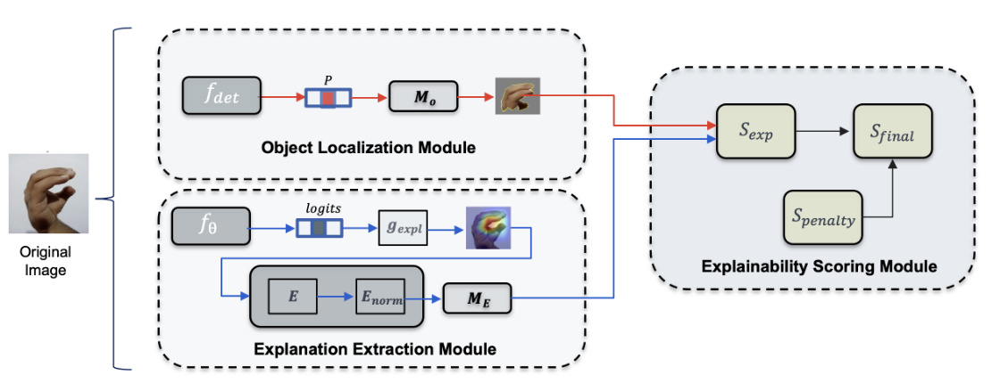

# Q-MEX: Quantitative Metric for Explainability  
*(Proof-of-Concept on Sign-MNIST)*

This repository provides a **reproducible** pipeline to:  
1️⃣ Fine-tune **MobileNetV2** on **Sign-MNIST** (grayscale → 224×224)  
2️⃣ Generate saliency maps using **LIME**  
3️⃣ Compute **Q-MEX** scores using a weighted alignment between explanation maps and object masks (hands detected 

> **Scope:** This work is a **proof of concept** focusing on a **hand gesture case study**. The Q-MEX framework is **model-agnostic** and **dataset-independent**; for large-scale datasets (e.g., ImageNet), replace the localization module (e.g., Mask R-CNN, SAM) accordingly.

